## Hangman Game

This is a Hangman game created in Python. It runs in the Code Institute mock terminal on Heroku. To play, the user must guess a letter from a 5 letter word. If the letter is in the word, the user's score goes up by one. If the letter is not in the word, the user loses one of seven lives. When the user has guessed all of the letters correctly, they win the game. If they don't guess the letters and their lives run out, they lose the game.

---

### Table of Contents

---

### Responsive MockUp
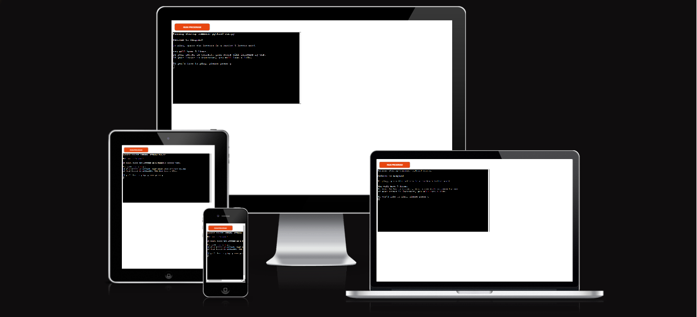

---

### User Experience
#### User Stories
* User Goals
    1. As a User, I want to understand the main purpose of the site.
    2. As a User, I want to be given an option to play the game or not.
    3. As a User, I want to understand the rules of the game.
    4. As a User, I want to be able to guess a letter and know that the game recognises my choice.
    5. As a User, I want to be able to see how many guesses I have made and see my current score.
    6. As a User, when the game ends, I want to see what the word was.
    7. As a User, when the game is finished, I want to be able to choose to play again or exit the game.

---

### Features
* Welcome Screen
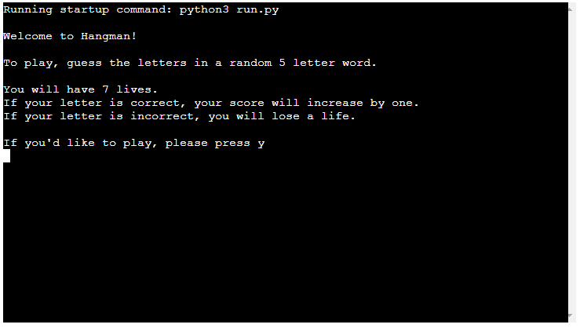
  On the welcome screen, the user can see the rules of the game. They are then asked to enter "y" if they want to play.

* Input Name
  * Correct Input
  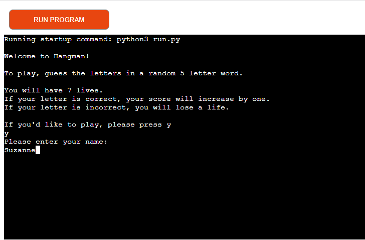
  On the welcome screen, the user is promted to enter their name.
  * Invalid Input
  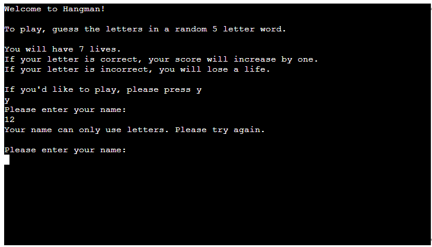
  If the user tries to enter anything other than letters, they get a message saying that they can only use letters. They can then try again.

* Guess Screen
  * First Guess
  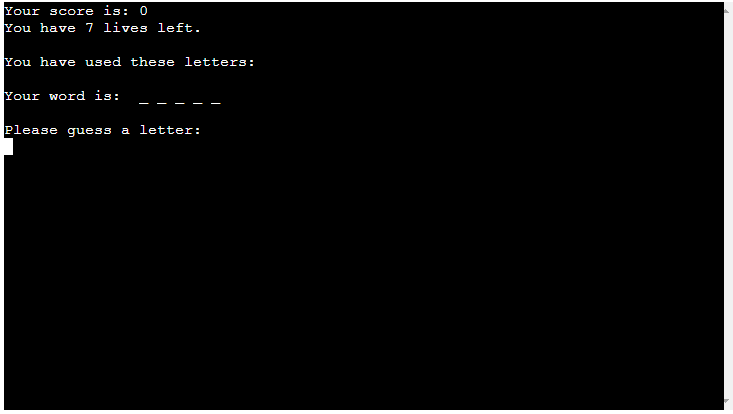
    For their first guess, the user is shown their word with dashes in place of the letters. Their score is 0 and their lives are at 7. They are prompted to input a letter.
  * Correct Guess
  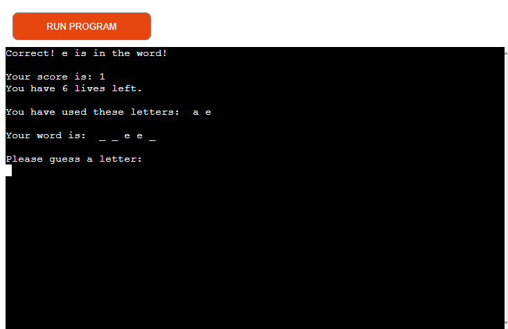
    When the user guesses a letter correctly, they get a message saying that their guess is correct. Their score increases by 1 and their lives are not affected. They can see what letters they have already guessed.
  * Incorrect Guess
  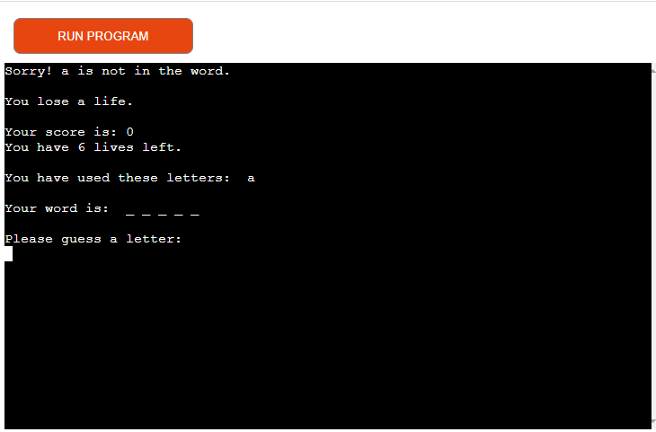
    When the user guesses a letter incorrectly, they get a message saying that their guess is not in the word. Their score is not affected but their lives decrease by one. They can see what letters they have already guessed.
  * Invalid Guess
  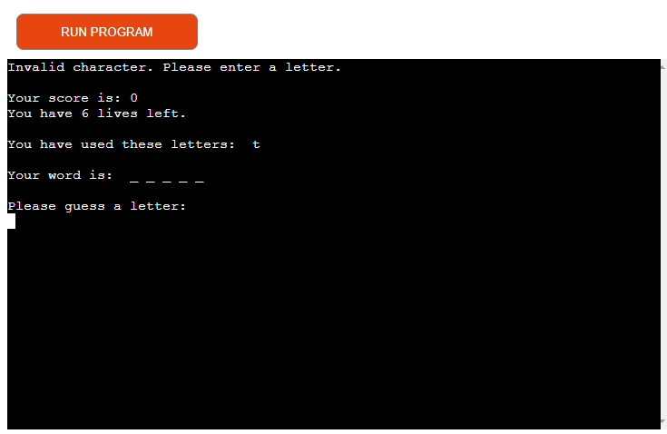
    If the user tries to input numbers, whitespaces or more than one letter, they will get a message saying that they have used an invalid character. Score and lives are not affected.
  * Already Guessed
  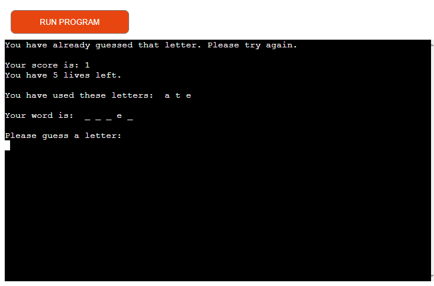
    If the user tries to guess a letter that they have already guessed, they will get a message saying that they already guessed that letter. Score and lives are not affected.

* Word is Right
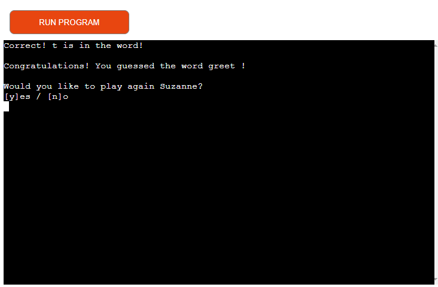
  If the user guessed all of the letters correctly, they get a message telling them that they guessed the word, and are shown the word. They are then asked if they want to play again. If they type "y", they are brought back to guess again for the first time, with score and lives reset, and are given a new word. If they type "n", they are brought back to the welcome screen.

* Word is Wrong
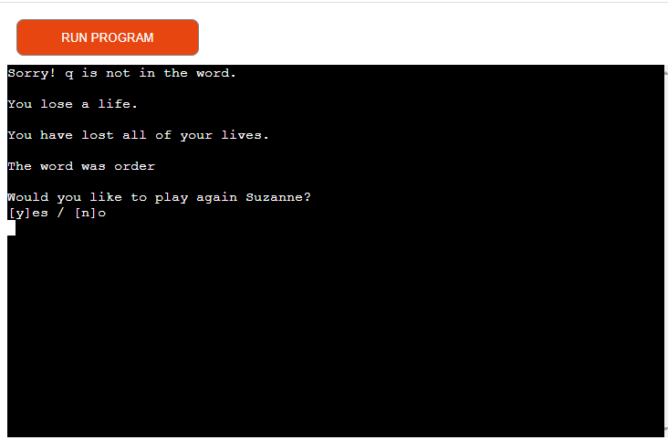
  If the user ran out of lives, they get a message to say they have lost all of their lives, and are shown the word they were trying to guess. They are then asked if they want to play again. If they type "y", they are brought back to guess again for the first time, with score and lives reset, and are given a new word. If they type "n", they are brought back to the welcome screen.

---

### Technologies Used
#### Languages Used
* Python

#### Frameworks, Libraries & Progrmas Used
1. gspread - This was used to open and read the information in the hangman google spreadsheet.
2. random - This was used to randomise the list of words that were retrieved from the spreadsheet.
3. os - This was used to set the os for clearing the output.
4. string - This was used to create a set containing the lower case alphabet.
5. sleep from time - This was used to add a time delay before clearing the output.
6. GitHub - This was used to store the projects code after being pushed from Git.
7. Git - This was used for version control by utilizing the Gitpod terminal to commit to Git.
8. Heroku - This was used to deploy the live version

---

### Testing
#### Validator Testing
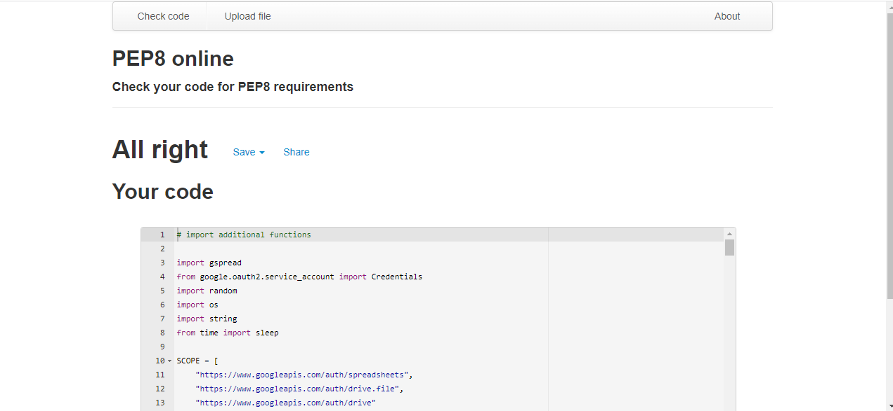

#### User Stories Testing
1. As a User, I want to understand the main purpose of the site.
  * I understand that this site it a Hangman game as the first line of text says "Welcome to Hangman"
2. As a User, I want to be given an option to play the game or not.
  * There is the option to enter "y" if I want to play the game. If I type "n" or any other character, I'm brought back to the welcome page.
3. As a User, I want to understand the rules of the game.
  * The rules of the game are displayed on the welcome page.
4. As a User, I want to be able to guess a letter and know that the game recognises my choice.
  * When I enter a guess, the letter I chose is displayed. If it's right, it appears in a dashed word. If it's not, I get a message to say that the letter is not in the word.
5. As a User, I want to be able to see how many guesses I have made and see my current score.
  * At the start, my score and how many lives I have are displayed on screen. After each guess, they are updated and displayed on screen.
6. As a User, when the game ends, I want to see what the word was.
  * If I win or lose, the word to be guessed is displayed in full.
7. As a User, when the game is finished, I want to be able to choose to play again or exit the game.
  * When I finish the game I'm given the option to play again. If I choose to play again, I get a new word to guess and my score and lives are reset. If I choose not to play again, I'm taken back to the welcome page.

#### Element Testing
Input Validation

* If you'd like to play, please press y:
  I tried inputting any other letter, numbers, special characters and whitespace and I got the message "Invalid character. Please enter y if you'd like to play."
* Please enter your name:
  I tried inputting any other letter, numbers, special characters and whitespace and I got the message "Your name can only use letters. Please try again."
* Please guess a letter:
  I tried inputting any other letter, numbers, special characters and whitespace and I got the message "Invalid character. Please enter a letter."  
  I also tried inputting a letter I had previously used and got the message "You have already guessed that letter. Please try again."
* Would you like to play again:
  I tried inputting any other letter except y and n, numbers, special characters and whitespace and I got the message "Invalid character. Please enter y or n"

#### Bugs
* ModuleNotFoundError: No module named 'gspread'
    * Install new version of pip (pip-22.1.2) - python -m pip install --upgrade pip
    * Install gspread.

* TypeError: object of type 'Worksheet' has no len()
  * Convert random word from list_of_words to string by defining a new empty variable as " ".join(list_word), using .join which takes all items and joins them into a string.

---

### Future Features
In the future, features to include are:
  * User will be able to create a username
  * Add a high score board

---

### Deployment

---

### Credits
#### Code
  * Python guidance and some code from The Python Workshop for Beginners Part 2 Udemy video by [XXX](https://www.udemy.com/course/the-python-workshop-for-beginners-part-2/learn/lecture/21928888#overview)
  * Some Python code came from Kylie Ying https://www.youtube.com/watch?v=cJJTnI22IF8&t=615s
  * Clear terminal code came from [Scaler] (https://www.scaler.com/topics/how-to-clear-screen-in-python/)
  * Boilerplate code came from [Code Institute](https://github.com/Code-Institute-Org/gitpod-full-template/tree/main/.vscode)
  * Most issues in the code were resolved by searching through [Stack Overflow](https://stackoverflow.com/)

#### Content
  * 5 hard to guess words taken from https://danq.me/2013/12/15/hangman/

#### Acknowlegdements
  * Inspiration for ReadMe came from the Code Institute Sample ReadMe, Code Institue ReadMe template, my own Project 1 ReadMe and suggestions from my Project 1 assesor.
  * My mentor Martina Terlevic for fantastic guidance.
  * Slack community.
  * 